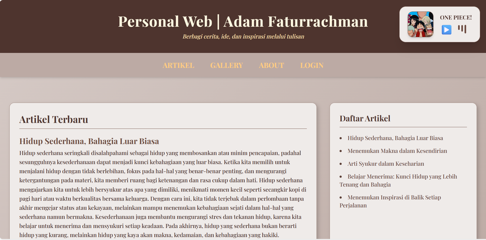
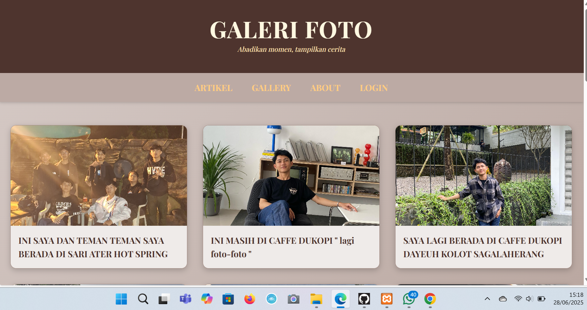
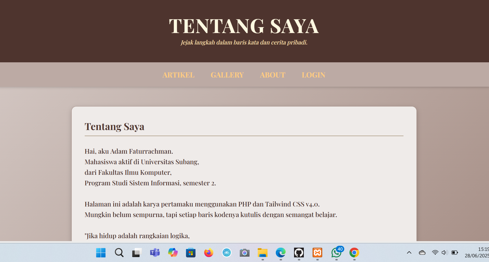
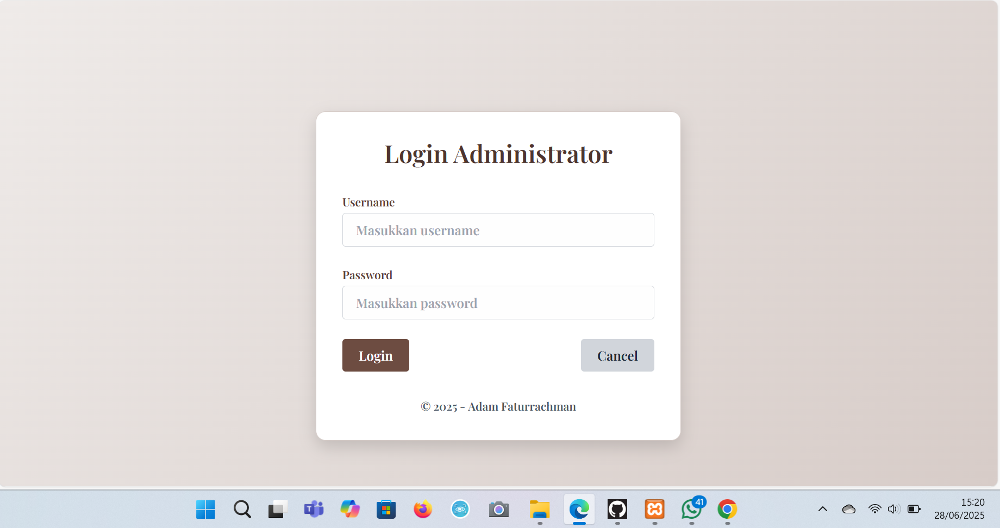
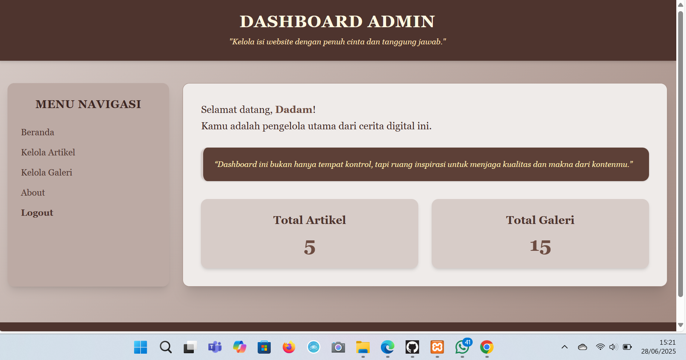
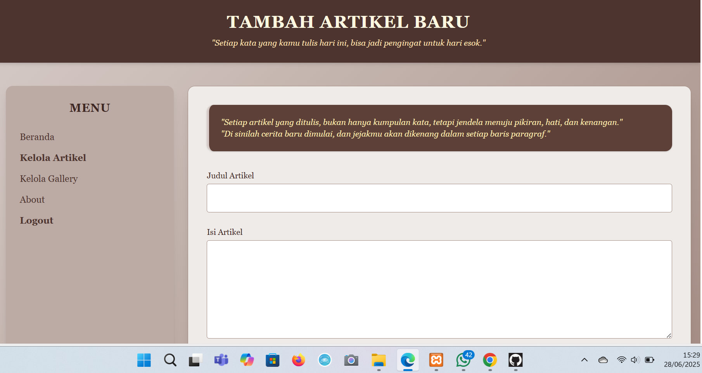
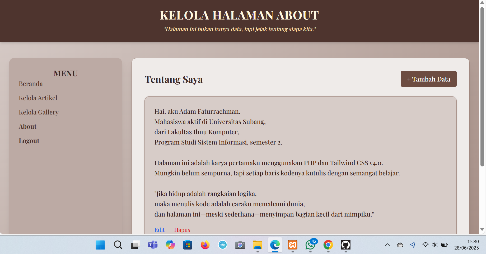

# AdamFtrrchmn-PersonalWeb
Personal Web Adam Faturrachman di Buat dengan TailwindCSS CDN 4.0
# 🌐 Personal Web | Adam Faturrachman

*Berbagi cerita, ide, dan inspirasi melalui tulisan dan galeri pribadi.*  
Dibuat sebagai proyek pembelajaran menggunakan PHP, Tailwind CSS, dan MySQL.

## 📌 Deskripsi Proyek

Website ini adalah *personal web* milik Adam Faturrachman yang menampilkan artikel pribadi, galeri foto, dan fitur admin untuk mengelola konten. Web ini bertujuan menjadi ruang ekspresi dan latihan praktis membuat web dinamis.

## ✨ Fitur-Fitur Aplikasi

### 📝 Halaman Publik
- *Beranda / Artikel Terbaru*  
  Menampilkan artikel terbaru dan daftar artikel.

- *Galeri Foto*  
  Galeri publik dengan momen pribadi.

- *About (Tentang Saya)*  
  Profil dan penjelasan singkat tentang pemilik web.

- *Login Admin*  
  Login untuk mengakses dashboard admin.
  
### 🛠 Halaman Admin
- *Dashboard Admin*  
  Menampilkan total artikel dan galeri.

- *Kelola Artikel*  
  Tambah, edit, dan hapus artikel.

- *Kelola Galeri*  
  Tambah, edit, dan hapus gambar galeri.

- *Kelola About*  
  Edit halaman tentang saya.

- *Logout*  
  Keluar dari halaman admin.
  
## 📷 Screenshot Tampilan

### 1. Beranda  

### 2. Galeri Foto  

### 3. Tentang Saya  

### 4. Form Login Admin  

### 5. Dashboard Admin  

### 6. Tambah Artikel Baru  

### 7. Kelola Halaman About  

### 8. Kelola Galeri  

## 🧰 Teknologi yang Digunakan
- *Frontend*: HTML5, Tailwind CSS v4.0  
- *Backend*: PHP Native  
- *Database*: MySQL  
- *Web Server*: XAMPP / Localhost

## 🚀 Cara Menjalankan Aplikasi
1. Clone atau download repositori ini.
2. Jalankan XAMPP, aktifkan *Apache* dan *MySQL*.
3. Import database dari file db_adam_d1a240046.sql ke phpMyAdmin.
4. Buka browser dan akses:  
   http://localhost/personal_adam_D1A240046/
5. Login admin di:  
   http://localhost/personal_adam_D1A240046/admin/login.php
   
## 📁 Struktur Folder
personal_adam_D1A240046/ ├── index.php ├── about.php ├── gallery.php ├── koneksi.php ├── db_adam_d1a240046.sql ├── admin/ │   ├── login.php │   ├── beranda_admin.php │   ├── data_artikel.php │   ├── data_gallery.php │   ├── about.php └── README.md

## 🙋‍♂ Tentang Pembuat
> Hai, aku Adam Faturrachman.  
> Mahasiswa aktif di Universitas Subang, Fakultas Ilmu Komputer,  
> Program Studi Sistem Informasi – Semester 2.
> 
Website ini adalah hasil belajarku untuk memahami bagaimana kode bisa menyimpan cerita.  
Mungkin sederhana, tapi dikerjakan dengan semangat.
